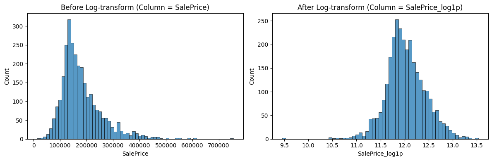
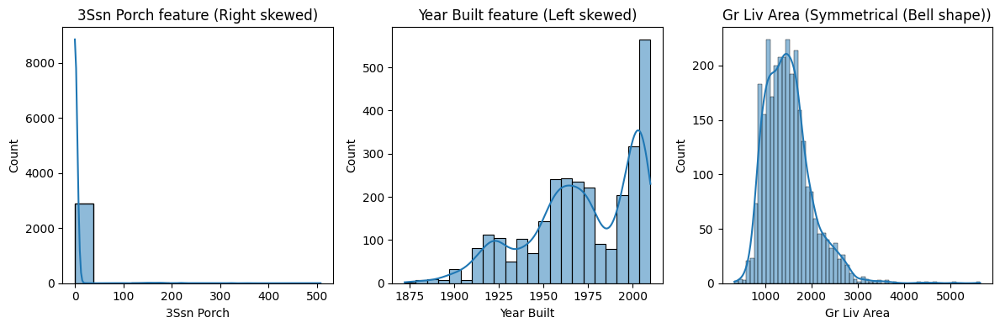
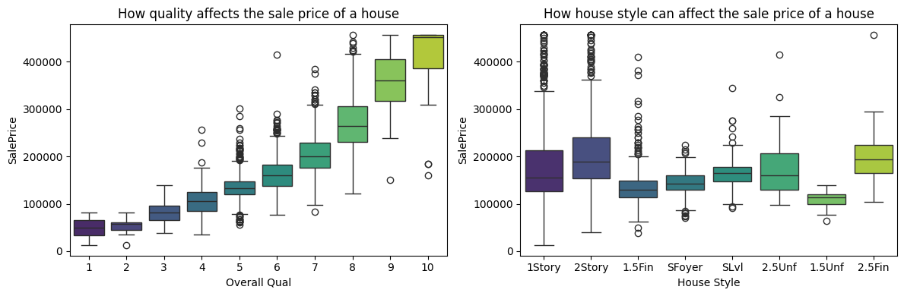
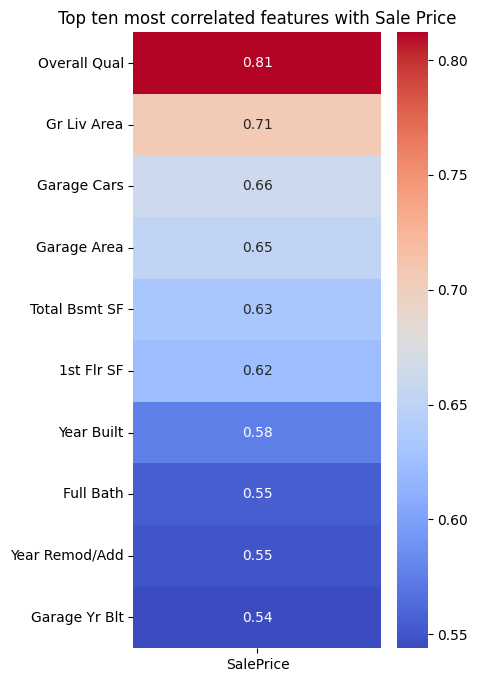

  <strong>Exploring House Prices in Ames, Iowa</strong>
   
  Eyad Ali Almiman | MLFoundationsCapstoneReport

1. Introduction :
    For this project I have used the recommended dataset for this project which is the Ames Housing dataset, which is made of 2930 rows and 82 features for houses in Ames, Iowa, United States of America. I have 4 goals to finish this project : 1) To clean the dataset from any outliers and any missing values. 2) Making helpful features and encoding data. 3) Exploring the data a bit deeper and getting charts. 4) Using math to find about how the mean, the std and other things 

2. Cleaning Summary : 
    The raw dataset had several problems that needed fixing before analysis :

        Data types : 
            When I was looking at the data types and I found that there were two categorical columns that had the wrong data type and they are : “Ms subClass” and “Sale Condition”; They are both supposed to be categorical columns but MS SubClass is an int64 (integer) and Sale Condition is an str (string), so we changed them back into the object data type

        Missing values : 
            While searching the dataset for missing values I have found 1 column that is made out of more than 50% of missing values and it is Pool QC; I dropped it because imputing it would be undependable and I cant use the data because it is more than 50% made up data. For the other numerical column that has missing values in it Garage Finish; I just filled in the missing values with np.nan then changing it to “None” so it won’t be detected as a numerical value when using the column

        Outliers : 
            After I made all of the past changes I checked for outliers by using a box plot and capping them in the “SalePrice” column
    
    Last but not least I have made a clean_data() function to wrap all of the features I have made into one easy to use function for whenever I need to use it again and when it’s done it gives you a checklist of what it did and if it did it correctly

3. Feature Engineering Summary :
    I created several new features to capture information the raw columns alone could not :

        One-hot encoding : 
            I used one-hot encoding on two categorical columns, which are : Heating and Central Air. Then putting our outputs into either one of two prefixes depending on where the data came from, and the two prefixes are : Heat and C-Air

        Ordinal encoding :
            I used ordinal encoding to encode every piece of data in the column "Kitchen Qual" into three categories and they are : "low", "medium" and "high”

        Standard Scaler :
            I used Standard Scaler to scale two columns and they are : "Total Bsmt SF" and "1st Flr SF". There are two outputs and they are for mean and std (Standard Devation) 

        Domain Driven encoding :
            I made 2 different Domain Driven features, one of them is "price_per_sqft" which was taken from the instruction for this phase and tells you how much every square foot of this house costs, then we have the next feature which is "overall score" which was taken from Google Gemini and it tells you the overall score of the house out of 100 by multiplying the condition and the quality of the house
    
    I also log transformed to fix the “SalePrice” column, it was right skewed before I used log1p(). After the log1p transformation it became 90% like a bell shape

    

4. Exploratory Data Analysis Summary : 

    Finding 1 — I found out that “3Ssn Porch” is the most right skewed column and that the “Year Built” column is the most left skewed column and that the “Gr Liv Area” column is symmetrical (aka : bell shape) as seen in figure 2

    Finding 2 — I found out that the overall quality of the house affects the sale price of the house and how the house style affects the sale price as seen if figure 3

    Finding 3 — I found out that the most correlated feature with the “SalePrice” feature is the “Overall Qual” feature with a score of 0.81 percent; that means that “Overall Qual” is basically the same as “SalePrice” as seen in figure 4

5. What I Would Do Next :
    If I had more time, I would: (1) train a simple prediction model for if I need to check a new house that I didn’t yet calculate (2) Investigate and research for if I have the same house but in a different neighborhood would the price change? (a possible interaction effect); and (3) look at how sale prices changed over the years in the dataset to check for time trends.

  ______________________________________
    
  <strong>Sources :</strong> Geeks for Geeks, Google search, reddit, ChatGPT, Google Gemini
    
  <em>Note: Wherever "Google Gemini" or "ChatGPT" or any other AI is mentioned, I only got the idea from it, not the code unless stated otherwise.</em>